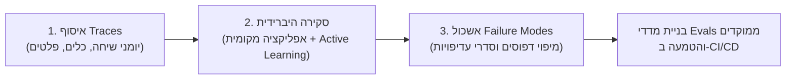

> **תשובה מהירה (Zero-Click Answer):**  
> הערכות ביצועים (Evals) הן מערכת הבדיקות והאיכות של מודלים וסוכני AI, אך כתיבת מדדים (Metrics) מוקדם מדי מובילה למדידת הדברים הלא נכונים. השיטה הנכונה מבוססת על **Error Discovery (גילוי שגיאות)**: מיפוי יומני ריצה מלאים (Traces), סקירה ידנית של מדגם מגוון למניעת Criteria Drift (סחיפת קריטריונים), ושימוש בסוכן קוד (Coding Agent) לבניית אפליקציית תיוג מקומית ואשכול דפוסי כשל (Failure Modes) לסדרי עדיפויות ממוקדי ROI.

---

אם שוחחתם לאחרונה עם מנהלי מוצר AI, מובילי פיתוח או סמנכ"לי כספים שמטמיעים מודלי שפה בארגון, המילה **Evals (הערכות ביצועים)** עלתה כנראה בכל שיחה שנייה. מייק קריגר (לשעבר ה-CPO של אינסטגרם וראש מעבדות Anthropic כיום) הדגיש לאחרונה כי *"אם יש מיומנות קריטית אחת שעלינו ללמד אנשי מוצר וטכנולוגיה, היא כתיבת Evals"*. גארי טאן, מנכ"ל Y Combinator, הכריז כי *"Evals הן החפיר (Moat) התחרותי האמיתי של חברות AI"*, ויותר ויותר מנהלים מתייחסים ל-Evals כאל ה-PRD החדש (Product Requirements Document).

חברות מובילות כבר מציגות תוצאות עסקיות חותכות מאימוץ מתודולוגיית Evals:
* **Shopify** השתמשה ב-Evals כדי לפתח בונה תהליכי עבודה מבוסס AI שהיה מהיר פי 2.2 וזול ב-68% ממודל ה-Frontier שהוחלף.
* **Cursor** שיפרה את מנגנון הניתוב האוטומטי (Auto Balance) שלה, מה שהביא לשביעות רצון גבוהה בהרבה לצד הפחתת עלויות תפעול ב-41%.
* **Ramp** הקפיצה את דיוק מערכת איסוף והתאמת הקבלות האוטומטית שלה מ-35% ל-83% לאחר השקעה ב-Evals.
* **Harvey** בנתה מחדש את סוכן בדיקת החוזים המשפטיים והכפילה את ציון האיכות הפנימי של המוצר.

אבל כאן בדיוק מסתתרת המלכודת: בעבודה עם מעל 50 חברות מובילות, המומחים המובילים בתחום — האמל חוסיין (Hamel Husain) ושריה שנקר (Shreya Shankar) — גילו שרוב הצוותים קופצים מיד לשלב כתיבת המדדים (Metrics) ובניית לוחות בקרה נוצצים, ומדלגים לחלוטין על השלב המכריע ביותר: **Error Discovery (גילוי שגיאות)**.

במדריך מעשי זה נפרק את מתודולוגיית ה-Evals המתקדמת, נבין מדוע כשלים קריטיים חומקים מתחת לרדאר של מודלים פיננסיים וסוכני שירות, וכיצד ניתן להקים תהליך גילוי שגיאות היברידי בתוך כ-30 דקות באמצעות סוכני קוד דוגמת Claude Code או Codex.

---

## המלכודת: למה כתיבת מדדים מוקדמת מזיקה למוצר שלכם?

מוצרי וסוכני AI קלים מאוד לשינוי, אך קשים מאוד לחיזוי. שינוי קטן ב-System Prompt, החלפת מודל או עדכון קל בקוד יכולים לשפר משימה אחת אך לשבור לחלוטין משימה אחרת. Evals נועדו להמיר את שיקול הדעת האנושי שלכם למבחנים אוטומטיים ורפיטטיביים שרצים לפני כל שחרור לגרסת ייצור.

מדוע אם כן רוב הצוותים נכשלים?

סריקת יומני אינטראקציה (Traces) ארוכים של משתמשים נתפסת כעבודה שחורה, איטית וקשה לסקייל, בעוד שכתיבת מדדים מספריים (כמו Accuracy, BLEU, ROUGE או התאמת מילות מפתח) היא קונקרטית, פשוטה לאוטומציה ונראית מצוין במצגות הנהלה. אך כשכותבים מדדים מוקדם מדי:
1. **מבצעים הנחות יסוד שגויות:** מניחים שיודעים מראש מהן נקודות השבר של המודל.
2. **מודדים את הדברים הלא נכונים:** מייצרים "מדדי יהירות" (Vanity Metrics) שלא משקפים את החוויה האמיתית של הלקוח או את הדיוק העסקי הנדרש.
3. **מפספסים את ה-ROI:** בדומה לכך ש-Product Discovery מגלה אילו בעיות שווה לפתור, **Error Discovery מגלה אילו שגיאות שווה למדוד ולעקוב אחריהן לאורך זמן**.

> [!IMPORTANT]
> **כלל זהב:** אם יש לכם זמן לבצע רק חלק אחד מתוך כל תהליך ה-Evals — תנו עדיפות מוחלטת ל-Error Discovery. ללא שלב זה, תבנו מדדים סביב תקלות תיאורטיות ותפספסו את הנזקים האמיתיים בפרודקשן.

---

## מהו Criteria Drift (סחיפת קריטריונים) וכיצד הוא מפיל מערכות AI?

אחת השגיאות הנפוצות היא לזרוק תיקייה של יומני ריצה (Traces) על מודל או סוכן ולבקש ממנו: *"מצא לי את כל התקלות"*. 

אמנם מודלי AI מהירים במציאת שגיאות תחביריות או סתירות ברורות, אך הם עיוורים לחלוטין כאשר הכשל תלוי ב**הגדרת ההצלחה העסקית של המוצר**. יתרה מכך — את הסטנדרטים וההגדרות המדויקות להצלחה אנו מגלים לרוב רק **תוך כדי סקירת הנתונים בפועל**. לתופעה זו קוראים **Criteria Drift (סחיפת קריטריונים)**.

### דוגמה מעשית מהשטח: עוזר הליסינג הדיגיטלי (Nurture Boss)

במחקר מעמיק שבוצע על סוכן AI לניהול שיחות עם שוכרי דירות פוטנציאליים, נבחנה האינטראקציה הבאה:

```text
פרוספקט: "המחיר הזה חורג מהתקציב שלי. תודה רבה על השירות."
עוזר ה-AI: "בשמחה רבה! אם המצב ישתנה או אם יהיו לך שאלות נוספות בעתיד, אל תהסס לפנות. שיהיה לך יום נפלא!"
```

עבור רוב סוכני ה-AI והמדדים האוטומטיים, מדובר בשיחה מושלמת: המענה אדיב, תקין תחבירית ומנומס. 
אך מנקודת מבט עסקית מדובר ב**כישלון קולוסאלי**: מטרת המוצר היא לסגור עסקאות ולסייע לשוכרים למצוא נכס מתאים. במקום להיפרד בנימוס, הסוכן היה חייב להציע יחידות זולות יותר באותו בניין או נכסים חלופיים של החברה (טיפול בהתנגדויות - Objection Handling).

אם היינו מגדירים מראש לסוכן לחפש "חוסר בטיפול בהתנגדויות מחיר", הוא היה מאתר זאת בקלות. אך גילינו שזהו קריטריון חובה רק לאחר שעין אנושית צפתה ב-Trace האמיתי.

### תוצאות סריקת 100 שיחות פרודקשן:
במחקר מקיף על 100 יומני ריצה אמיתיים של הסוכן נמצאו תובנות קריטיות:
1. **סוכנים פספסו כשלים שדורשים שיקול דעת מוצרי והקשר חיצוני:** למשל, שימוש בעיצובי Markdown לא נתמכים ב-SMS, אי-ביצוע Human Handoff בזמן, או החמצת הזדמנויות מכירה.
2. **סוכנים מצטיינים בזיהוי סתירות פנימיות בתוך ה-Trace:** למשל, כאשר המודל טוען שדירה פנויה למרות שקריאת ה-API (Tool Call) החזירה שהיא כבר הושכרה.
3. **סוכנים מייצרים "רעש" (False Positives):** הם מתייגים תשובות טובות ותקינות ככישלונות עקב היעדר גמישות.

המסקנה הברורה: אוטומציה מלאה נכשלת, ועבודה ידנית בלבד אינה ניתנת להרחבה. הפתרון הוא **תהליך היברידי (Active Learning)** המשלב שיקול דעת אנושי עם סוכני קוד.

---

## שלושת השלבים לגילוי שגיאות שיטתי (Error Discovery Framework)

כדי לגלות כשלים בצורה מהירה ואפקטיבית, נשתמש במתודולוגיית שלושת השלבים של האמל ושריה, הנתמכת כעת באמצעות פלאגין ה-Skills הייעודי (`evals-skills`).



---

### שלב 1: איסוף ומיפוי Traces (יומני ריצה מלאים)

Trace הוא התיעוד המלא של סשן אינטראקציה יחיד של משתמש מול המערכת. הוא חייב לכלול את כל הנתונים הנדרשים לבודק אנושי כדי לשחזר מה קרה ולהכריע האם התוצאה הייתה איכותית:
* קלט המשתמש (User Input)
* ה-System Prompt וההנחיות
* כל קריאות הכלים (Tool Calls) והתשובות שהתקבלו ממסדי הנתונים / ה-APIs
* תוצאות שליפה (Retrieved Context / RAG)
* קריאות מודל ביניים (Intermediate Reasoning)
* הפלט הסופי שהוצג למשתמש


אם המערכת שלכם אינה מתעדת Traces באופן מובנה, תוכלו להנחות את סוכן הקוד שלכם (כגון [Claude Code](/blog/chisachon-baelut-claude-code) או Codex) להטמיע Instrumentation בקוד באמצעות הפרומפט הבא:

<details style="margin: 1.5rem 0; padding: 1.25rem; border-radius: 0.75rem; border: 1px solid #e2e8f0; background: #f8fafc;">
<summary style="cursor: pointer; font-weight: 600; color: #1d4ed8; font-size: 1.05rem; outline: none;">👉 לחצו כאן לצפייה בפרומפט להטמעת רישום Traces בקוד המערכת</summary>

```text
Instrument this app so every user session with the AI is logged as one complete trace.

A trace is one user session. Include the user input, the system prompt, every tool call and its result, any retrieved context, every intermediate model call, and the final user-facing output.

If this app already sends traces to a vendor (LangSmith, Arize, Phoenix, Langfuse, or similar), keep using that. Also write a local copy: one JSON object per session, appended to traces/traces.jsonl. If there is no vendor, the JSONL file is enough.
```

</details>

#### טיפ למקצוענים: יצירת Traces סינתטיים לפני השקה
אם המערכת טרם הושקה ואין לכם עדיין משתמשי אמת, אל תסתפקו בבקשה כללית מה-LLM לייצר דוגמאות. הגדירו **ממדים (Dimensions)** שבהם המערכת עלולה להיתקל, ושלבו ביניהם ליצירת תרחישים עשירים:

<details style="margin: 1.5rem 0; padding: 1.25rem; border-radius: 0.75rem; border: 1px solid #e2e8f0; background: #f8fafc;">
<summary style="cursor: pointer; font-weight: 600; color: #1d4ed8; font-size: 1.05rem; outline: none;">👉 לחצו כאן לצפייה בפרומפט ליצירת תרחישים וקובץ נתונים סינתטי מגוון</summary>

```text
Create a script that generates synthetic user queries for an AI financial analysis assistant. Use the dimensions and values below as fixed inputs. Do not add or change them.

Task: variance analysis (AVB), revenue forecasting, EBITDA reconciliation, expense anomaly detection
User Persona: CFO, junior accountant, department manager, board auditor
Request Clarity: perfectly clear, highly ambiguous, out of scope / non-financial

Create a structured list of test scenarios by combining one value from each dimension. Loop through the scenarios and make a separate model call for each one. Pass only one scenario into each call. Enforce a structured output schema with a single user_query field, then save the query alongside its scenario in synthetic_queries.jsonl.
```

</details>

---

### שלב 2: סקירה היברידית ותיוג חכם באמצעות אפליקציה מקומית

כדי לאפשר סקירה מהירה ללא סרבול, פלאגין ה-Evals יוצר **אפליקציית סקירה מקומית המותאמת אישית לנתונים שלכם**.

התקינו את הפלאגין בסביבת הפיתוח באמצעות npx:

```bash
npx skills add https://github.com/ai-evals-course/evals-skills
```

הפנו את סוכן הפיתוח שלכם לפקודה:
> *"Use the evals-start skill. My traces are in traces/traces.jsonl and I want to find issues occurring in my AI product."*

הסוכן ילמד את ה-Schema של ה-Traces שלכם, יבנה שרת מקומי, ויציג ממשק מותאם אישית:
* **עיקרון תצוגה מציאותית (WYSIWYG):** הודעות SMS יוצגו כהודעות טקסט, דוחות פיננסיים יוצגו כטבלאות, וניתוח מסמכים יוצג כטקסט עם סימוני הדגשה.
* **חשיפת מטא-דאטה קריטית:** ערוץ הגעה, זמני תגובה, קריאות כלים וכמויות טוקנים.


#### אשכול ראשוני (Clustering) למניעת הטיה
הכלי מקבץ את ה-Traces לאשכולות (Clusters) סמנטיים ומציג מדגם מייצג של דוגמאות מגוונות, במקום סריקה כרונולוגית מקרית:


#### כללי ברזל לתיוג Traces (Human-in-the-Loop):
1. **תייגו לפחות 10 מקרים ראשונים בעצמכם:** אל תתנו ל-AI להציע תיוגים לפני שבדקתם 10 דוגמאות באופן עצמאי. זהו מחסום מכוון נגד Automation Bias (הטיית אוטומציה).
2. **תארו את הבעיה בצורה קונקרטית:** במקום לכתוב *"תשובה גרועה"*, כתבו *"הסוכן דיווח שההוצאה אושרה כאשר קריאת ה-ERP הראתה שהתקציב חרוג ב-25%"*.
3. **אל תבצעו ניתוח סיבת שורש (Root Cause) בזמן התיוג:** התמקדו במה שהשתבש בחוויית המשתמש, לא בלמה מסד הנתונים כשל פנימית.
4. **עיקרון העצירה בשגיאה הראשונה במעלה הזרם (First Upstream Error):** אם בסשן יש 3 שגיאות שונות, תייגו רק את הראשונה. תקלות במעלה הזרם גוררות אחריהן כשלים נגררים במורד הזרם.

לאחר 10 תיוגים, הסוכן יתחיל ללמוד את ההעדפות שלכם ולהציע תיוגים ל-Traces הבאים:


---

### שלב 3: הפיכת Failure Modes לסדרי עדיפויות מוצריים ומדדי איכות

לאחר שתייגתם כ-100 אינטראקציות, סוכן הקוד מאגד את ההערות שלכם לדפוסי כשל רוחביים (**Failure Modes**), סופר את תדירותם וממפה אותם לפי השפעה עסקית:


כעת יש לכם ביד מפת דרכים מדויקת לפיתוח ושיפור:
1. **פתרון תקלות הליבה (Fixing the Model/Pipeline):** תיקון ה-Prompt, שיפור קריאות ה-API, או הוספת בדיקות [אימות נתונים לפני הכל](/blog/אימות-נתונים-לפני-הכל-אל-תתנו-ל-ai-לנתח-לפני-שווידאתם-ששורות).
2. **בניית מדדי Evals ממוקדים (Targeted Metrics):** כעת כשאתם יודעים בדיוק אילו 4-5 כשלים מתרחשים בפועל, אתם כותבים Assertions ו-LLM-as-a-Judge ספציפיים שבודקים רק אותם!
3. **הטמעה ב-CI/CD:** כל כשל בפרודקשן שנתפס הופך ל-Test Case קבוע במערכת ה-Evals, כך שרגרסיות נחסמות לפני הגעה לייצור.

---

## השלכות ישירות על עולם ה-Finance, Ops & FP&A

בעולם הפיננסי — שבו דיוק במספרים, עמידה ברגולציה וסודיות הם ערכים עליונים — הטמעת Evals אינה רק "Best Practice טכנולוגי", אלא דרישת סף לניהול סיכונים.

הנה כיצד עקרונות ה-Error Discovery מיושמים בתהליכים פיננסיים:

| תהליך פיננסי | שגיאת ה-AI הנפוצה (Failure Mode) | כיצד Error Discovery פותר זאת |
| :--- | :--- | :--- |
| **איסוף והתאמת קבלות (Ramp)** | זיהוי שגוי של מע"מ או התעלמות מסעיפי פטור | איסוף Traces מקבלות ספציפיות, בניית בדיקה אוטומטית לעמידה בחוקי מס מקומיים |
| **בדיקת חוזי רכש ו-SLA (Harvey)** | אישור סעיפי חידוש אוטומטי ללא התרעה מתאימה | תיוג עסקאות עבר, אימון שופט LLM ייעודי לזיהוי חריגות משפטיות |
| **מודל תזרים מזומנים (FP&A)** | סכימת שורות ללא התחשבות במועדי אשראי (Net 60) | הוספת שלבי [אימות נתונים](/blog/אימות-נתונים-לפני-הכל-אל-תתנו-ל-ai-לנתח-לפני-שווידאתם-ששורות) ובניית [Agent Skills ייעודיים](/blog/agent-skills-financial-audit) |
| **אופטימיזציית עלויות מודל** | צריכת טוקנים מיותרת בשיחות ארוכות | מדידת ביצועים מדויקת ומעבר למודלים קלים יותר על פי תוצאות ה-Evals ([צמצום עלויות טוקנים](/blog/ai-token-optimization-finance)) |

---

## סיכום והמלצות יישום

1. **אל תתחילו ממדדים:** אל תבנו דאשבורדים סביב ציונים כלליים לפני שראיתם בעיניים את ה-Traces של המוצר שלכם.
2. **אמצו את ה-Criteria Drift:** צפו לכך שההגדרה שלכם למהו "פלט איכותי" תשתנה ותתחדד תוך כדי סקירת הנתונים.
3. **השתמשו בסוכני קוד כמכפילי כוח:** שלבו את פלאגין ה-Evals (`evals-skills`) יחד עם Claude Code או Codex כדי להקים אפליקציות סקירה מקומיות תוך דקות.
4. **הפכו כל שגיאה לחפיר עסקי:** כל תקלה שמתגלה ומומרת למבחן Eval קבוע מרחיקה אתכם מהמתחרים ומבטיחה שהמערכת שלכם הופכת לאמינה יותר בכל שבוע.

---

## הצעד הבא

הצעד הבא שלך הוא לעוד מידע, תוכן ומדריכים לפני כולם. הירשם לספריית התוכן AI Finance Transformation.

<div style="display: flex; justify-content: center; margin: 3rem 0;">
  <a href="https://www.ronenamoscpa.co.il/" style="
    display: inline-flex;
    align-items: center;
    justify-content: center;
    padding: 1rem 2.5rem;
    font-size: 1.125rem;
    font-weight: 600;
    color: white;
    background: linear-gradient(135deg, rgb(20, 184, 166) 0%, rgb(14, 165, 233) 100%);
    border-radius: 0.75rem;
    text-decoration: none;
    transition: all 0.3s cubic-bezier(0.4, 0, 0.2, 1);
    box-shadow: 0 0 30px rgba(20, 184, 166, 0.5), 0 10px 25px rgba(20, 184, 166, 0.3);
    border: 1px solid rgba(20, 184, 166, 0.3);
  " onmouseover="this.style.boxShadow='0 0 40px rgba(20, 184, 166, 0.8), 0 15px 35px rgba(20, 184, 166, 0.5)'; this.style.transform='translateY(-2px)';" onmouseout="this.style.boxShadow='0 0 30px rgba(20, 184, 166, 0.5), 0 10px 25px rgba(20, 184, 166, 0.3)'; this.style.transform='translateY(0)';">
    להרשמה ורכישת מנוי לספריית התוכן ←
  </a>
</div>

---

### קישורים מומלצים להרחבה:
* [סוכני ביקורת פיננסית וניתוח נתונים (Agent Skills)](/blog/agent-skills-financial-audit)
* [אימות נתונים לפני הכל: אל תתנו ל-AI לנתח לפני שווידאתם שורות](/blog/אימות-נתונים-לפני-הכל-אל-תתנו-ל-ai-לנתח-לפני-שווידאתם-ששורות)
* [בניית Skills לצוותי FP&A וניהול כספים](/blog/בניית-skills-לצוות-fpa)
* [אופטימיזציה של טוקנים וחיסכון בעלויות LLM](/blog/ai-token-optimization-finance)
* [קורס AI פיננסי ומאסטרי למנהלי כספים וחשבים](/courses/ai-mastery)
* [שירותי ייעוץ והטמעת מערכות AI בארגונים](/services)
