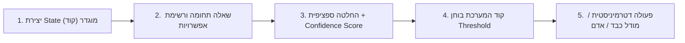

> **תשובה מהירה (Zero-Click Answer):**  
> **Jev AI** הוא מודל שפה מסוג **System 1** שפותח על ידי דיוגו אלמיידה (חוקר OpenAI לשעבר) בחברת TypeSafe AI. בניגוד למודלי Generative LLMs מסורתיים (כמו Claude או ChatGPT) המייצרים טקסט טוקן-אחר-טוקן, Jev אינו מייצר מילים כלל אלא מקבל החלטות סמנטיות מוגדרות מראש (Typed Decisions) מתוך רשימת אפשרויות סגורה. המודל פועל פי 200 מהר יותר, בעלות נמוכה פי 400 (\$0.042 בלבד למיליון טוקנים של קלט עם פלט חינמי), ומשמש כשכבת בקרה סמנטית (Semantic Control Layer) מהירה ויציבה בין קוד דטרמיניסטי למודלי שפה כבדים.

אחד החוקרים המרכזיים שהשתתפו בבניית ChatGPT מבית OpenAI, דיוגו אלמיידה (Diogo Almeida), הביא לאחרונה לעולם את **Jev** דרך חברת **TypeSafe AI**. Jev מסמן שינוי פרדיגמה עמוק בעולם הבינה המלאכותית: **מודל שלא מסוגל לכתוב מילה אחת, אך מסוגל לקבל החלטות מורכבות באלפיות שניה.**

כרואה חשבון ויועץ AI לארגונים, אני נתקל מדי יום באותה הבעיה: צוותים פיננסיים ומפתחים מריצים מודלי שפה ענקיים ויקרים עבור החלטות סיווג פשוטות. כפי שהסברתי בהרחבה ב[מדריך לצמצום צריכת Tokens בעבודה עם AI](/blog/ai-token-optimization-finance), מרבית הבזבוז והאיטיות במערכות AI נובעים מהפעלת "תותחים כבדים" על משימות ניתוב בסיסיות. 

Jev מגיע בדיוק כדי לפתור את הכשל הזה.

---

## מה זה Jev AI ואיך עובדת ארכיטקטורת System 1?

מרבית מוצרי ה-AI כיום נשענים על מודלים גנרטיביים (Generative Models). כאשר אנו מבקשים מהם לסווג מסמך או לקבל החלטה, הם מתחילים לחשב הסתברויות ולחולל טקסט מילולי (System 2 — חשיבה איטית ומאומצת).

תהליך זה יוצר חסמים משמעותיים במערכות מבצעיות:
1. **זמני השהיה (High Latency):** המתנה של 2–5 שניות לכל צומת החלטה פשוט.
2. **עלויות טוקנים מנופחות:** תשלום כפול על קלט ופלט.
3. **סיכון לשבירת פורמט (JSON Parsing Errors):** מודל שפה עלול להוסיף טקסט מקדים ולהכשיל את האוטומציה.
4. **עומס חשיבה לא מבוקר:** חוסר יכולת לבצע [ניהול עומק חשיבה ובחירת מודלים מותאמת](/blog/model-veeffort-claude-code).


### Jev משנה את חוקי המשחק:
* **קלט:** מקבל טקסט ומצב מערכת נוכחי (State) יחד עם מרחב החלטות סגור (Bounded Enum Options).
* **פלט:** מחזיר מידית את הערך הנבחר + רמת ביטחון סטטיסטית מכוילת (Confidence Probability).
* **עלות:** **\$0.042 למיליון טוקנים קלט — ו-0$ על פלט!**
* **מהירות:** קבלת החלטה בפחות מ-50 מילישניות.

> 💡 **הגדרה הנדסית:** Jev הוא למעשה `switch statement` סמנטי וחכם במיוחד — מסווג נתונים אולטרה-מהיר עם האינטליגנציה והגמישות של מודלי 2026.

---

## 3 מקרי בוחן מוכחים מהשטח

תוך ימים ספורים מהשקתו, מפתחים חיברו את Jev למערכות חיות ופרסמו נתונים מרשימים:

### 1. ניתוח 724 פרסומות ב-40 שניות ב-9 סנט בלבד (מת'יו ברמן)
מת'יו ברמן (Matthew Berman) השתמש ב-Jev כדי לסווג 724 פרסומות חיות מ-37 מותגים שונים לפי Hook, פורמט, סוג ההצעה (Offer), שלב המודעות והתאמת דף נחיתה.


* **התוצאה:** 724 מודעות נותחו וסווגו במלואן בתוך **40 שניות** ובעלות של **9 סנט בלבד**.
* **התועלת:** הפיכת ספריית קריאייטיב לא-מובנית למסד נתונים סמנטי שניתן לבצע עליו חיתוכים ושאילתות SQL.

---

### 2. בקרת עומק חשיבה דינמית בסוכני קוד (Vechen & Codex)
המפתח Vechen שילב את Jev בתוך סביבת עבודה של OpenAI Codex כדי לנטר מתי הסוכן תקוע. Jev בדק בכל איטרציה את מצב הריצה:
* כשהמשימה הייתה מורכבת — Jev העלה את ה-Reasoning Effort של GPT-6 Astra.
* בשלבים פשוטים ורוטיניים — Jev הוריד את החשיבה למינימום.


* **התוצאה:** **חיסכון של 50% בעלויות המודל**, ריצה מהירה פי כמה, ושמירה מושלמת על ה-Prompt Cache.
* מומלץ לקרוא עוד על כך במדריך שלנו: [בחירת מודל והגדרת מאמץ חשיבה בסוכני קוד](/blog/model-veeffort-claude-code).

---

### 3. בוט מסחר בבלוקצ'יין בחלון זמן של 300ms (ג'רוד וואטס)
ג'רוד וואטס (Jarrod Watts) חיבר את Jev ל-Price Feed חי של צמד MON-USDC על רשת Monad. בכל בלוק (300 מילישניות), Jev מחליט האם לבצע קנייה, מכירה או המתנה ישירות מול ה-Order Book של Kuru.


* **התוצאה:** קבלת החלטה וביצוע פקודה בתוך חלון בלוק תת-שנייתי.
* **המשמעות:** מודלי בינה מלאכותית יכולים כעת לרוץ בתוך לולאות Real-Time קריטיות ללא צווארי בקבוק.

---

## הדפוס ההנדסי: State + Question + Judgment

ארבעת השלבים המרכיבים כל מערכת מבוססת Jev:




---

## יישום Jev במחלקות כספים, חשבות ו-FP&A

עבור מנהלי כספים, חיבור של System 1 לתהליכים פיננסיים מאפשר להקים [סוכני ביקורת ואימות פיננסי](/blog/agent-skills-financial-audit) מהירים ומדויקים:

| צומת החלטה פיננסי | הגישה המסורתית (LLM מלא) | הגישה המודרנית עם Jev AI |
| :--- | :--- | :--- |
| **סיווג חשבוניות והוצאות** | קריאה מלאה ל-Claude (\$0.02, 3 שניות) | סיווג מיידי מול עץ החשבונות ב-50ms (\$0.00004) |
| **בדיקת התאמות וחריגות** | פרומפט גנרטיבי ארוך שעלול להזות | אימות סמנטי חד: האם הפירוט תואם לסיכום? |
| **ניתוב שאילתות תקציב** | מודל שפה שמנסח תשובה מאפס | זיהוי מיידי של כוונת השואל והפניה לדשבורד |
| **בקרת עסקאות חשודות** | בדיקה אנושית ידנית או כללי SQL קשיחים | שילוב Jev לזיהוי חריגות והעברה לאישור CFO |

> ⚠️ **כלל ברזל פיננסי:** לפני שסוכן AI מקבל החלטה, חובה לבצע אימות נתונים מקדים. ראו את המדריך המלא: [אימות נתונים לפני הכל — אל תתנו ל-AI לנתח לפני שווידאתם שורות פירוט מול סיכומים](/blog/אימות-נתונים-לפני-הכל-אל-תתנו-ל-ai-לנתח-לפני-שווידאתם-ששורות).

---

## דוגמת קוד מעשית (Toggle View)

כדי לראות כיצד מתבצעת הקריאה ל-Jev API מקוד TypeScript / Node.js, לחצו על הלשונית למטה:

<details style="margin: 1.5rem 0; padding: 1.25rem; border-radius: 0.75rem; border: 1px solid #e2e8f0; background: #f8fafc;">
<summary style="cursor: pointer; font-weight: 600; color: #1d4ed8; font-size: 1.05rem; outline: none;">👉 לחצו כאן לצפייה בדוגמת הקוד המלאה (TypeScript / API Call)</summary>

```typescript
// דוגמת קריאה לשירות Jev של TypeSafe AI לסיווג עסקאות פיננסיות
interface JevDecisionResponse {
  decision: string;
  confidence: number;
  tokens_used: number;
}

async function routeFinancialTransaction(
  vendorName: string, 
  amountIls: number, 
  description: string
): Promise<JevDecisionResponse> {
  const response = await fetch('https://api.typesafe.ai/v1/decide', {
    method: 'POST',
    headers: {
      'Authorization': `Bearer ${process.env.JEV_API_KEY}`,
      'Content-Type': 'application/json',
    },
    body: JSON.stringify({
      state: {
        vendor: vendorName,
        amount: amountIls,
        memo: description,
        currency: "ILS"
      },
      question: "לאיזה סעיף הוצאה תקציבי שייכת עסקה זו?",
      options: [
        "Cloud_Infrastructure_AWS_GCP",
        "SaaS_Software_Subscriptions",
        "Office_Supplies_And_Equipment",
        "Legal_And_Accounting_Retainers",
        "Employee_Welfare_And_Travel",
        "Suspicious_Requires_Human_Audit"
      ]
    })
  });

  if (!response.ok) {
    throw new Error(`Jev API Error: ${response.statusText}`);
  }

  const result: JevDecisionResponse = await response.json();
  
  // אם רמת הביטחון נמוכה מ-90%, נעביר לבדיקה ידנית של חשב
  if (result.confidence < 0.90) {
    return { ...result, decision: "Suspicious_Requires_Human_Audit" };
  }

  return result;
}
```

</details>

---

## איך לבנות סוכנים מתקדמים בארגון?

אם אתם בונים סוכני AI לצוות הכספים, מומלץ לשלב את Jev לצד מיומנויות ייעודיות:
* קראו את המדריך לבניית יכולות מותאמות: [איך לבנות סקילים פיננסיים מותאמים אישית](/blog/claude-skills-building-guide).
* להקמת מערך FP&A אוטונומי: [בניית סקילים ייעודיים לצוות FP&A](/blog/בניית-skills-לצוות-fpa) וכן [מערכת FP&A חכמה שמסבירה את המספרים](/blog/מערכת-fpa-ai-שמסבירה-את-המספרים).
* להכשרת הצוות הפיננסי בפרקטיקות AI מתקדמות: הצטרפו ל[קורס AI Mastery למנהלי כספים](/courses/ai-mastery) או פנו אלינו ל[ייעוץ והטמעת אוטומציה פיננסית](/services).

## הצעד הבא

הצעד הבא שלך הוא לעוד מידע, תוכן ומדריכים לפני כולם. הירשם לספריית התוכן AI Finance Transformation.

<div style="display: flex; justify-content: center; margin: 3rem 0;">
  <a href="https://www.ronenamoscpa.co.il/" style="
    display: inline-flex;
    align-items: center;
    justify-content: center;
    padding: 1rem 2.5rem;
    font-size: 1.125rem;
    font-weight: 600;
    color: white;
    background: linear-gradient(135deg, rgb(20, 184, 166) 0%, rgb(14, 165, 233) 100%);
    border-radius: 0.75rem;
    text-decoration: none;
    transition: all 0.3s cubic-bezier(0.4, 0, 0.2, 1);
    box-shadow: 0 0 30px rgba(20, 184, 166, 0.5), 0 10px 25px rgba(20, 184, 166, 0.3);
    border: 1px solid rgba(20, 184, 166, 0.3);
  " onmouseover="this.style.boxShadow='0 0 40px rgba(20, 184, 166, 0.8), 0 15px 35px rgba(20, 184, 166, 0.5)'; this.style.transform='translateY(-2px)';" onmouseout="this.style.boxShadow='0 0 30px rgba(20, 184, 166, 0.5), 0 10px 25px rgba(20, 184, 166, 0.3)'; this.style.transform='translateY(0)';">
    להרשמה ורכישת מנוי לספריית התוכן ←
  </a>
</div>

---

## סיכום

Jev מסמן את תחילתו של עידן חדש בפיתוח סוכנים: **הפרדה מוחלטת בין שכבת קבלת ההחלטות (System 1) לשכבת החשיבה והניסוח המעמיקה (System 2)**. 

ארגונים שיאמצו את הארכיטקטורה הזו ייהנו מסוכנים מהירים פי כמה, בעלויות תפעול אפסיות וברמת אמינות חסרת תקדים.
